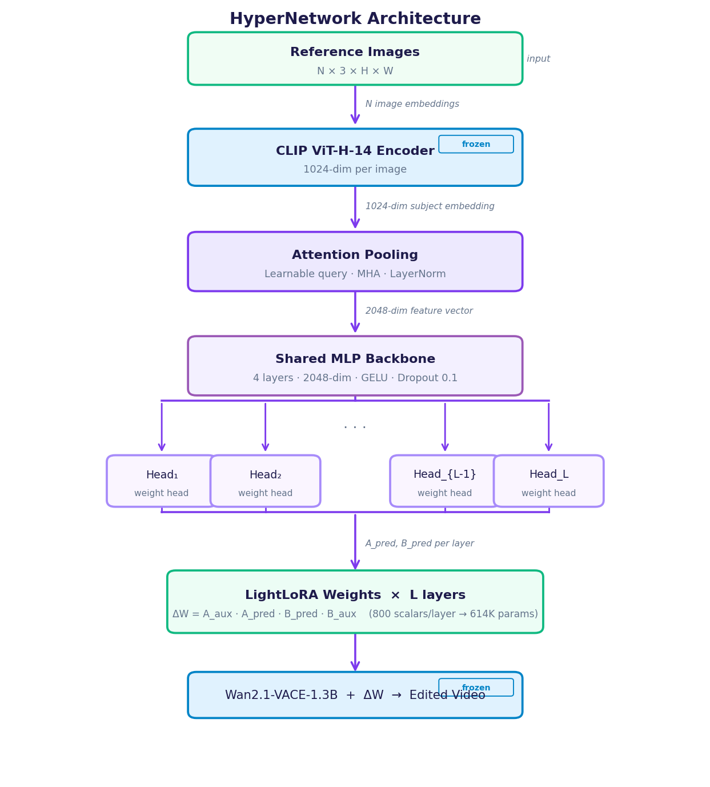
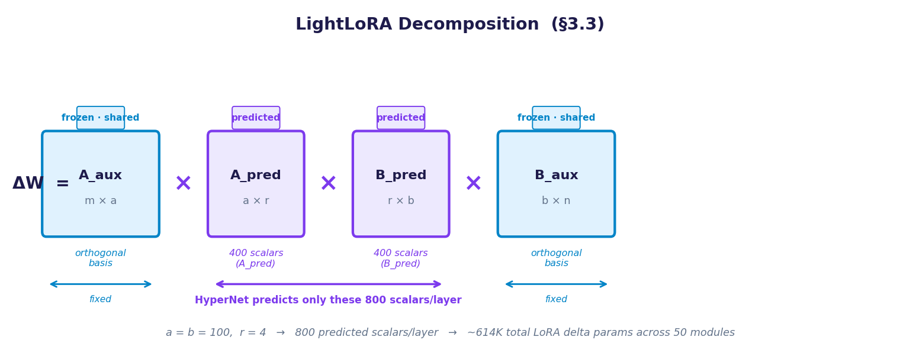
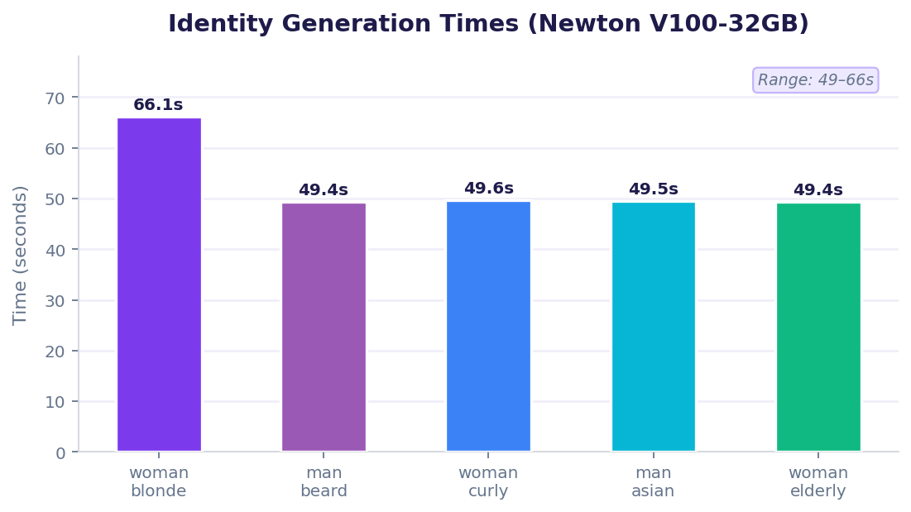
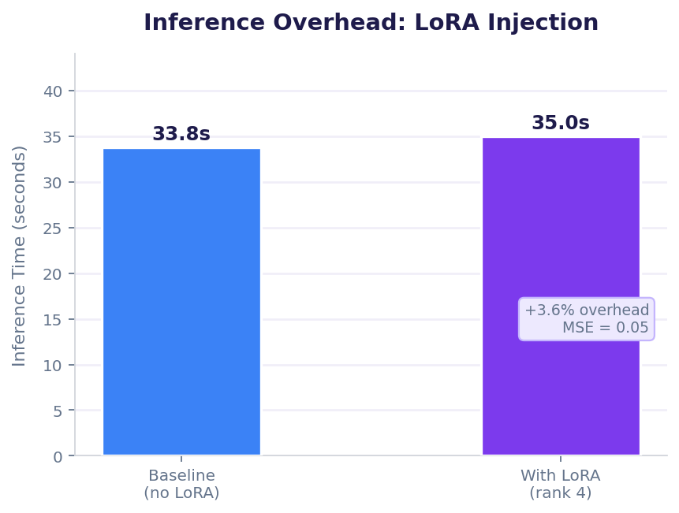
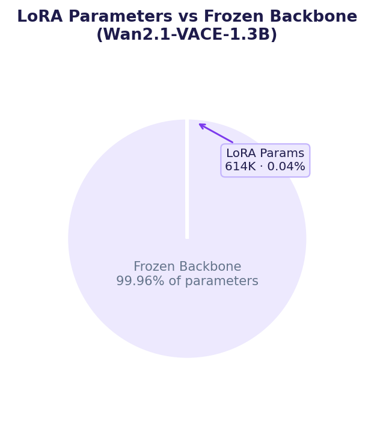
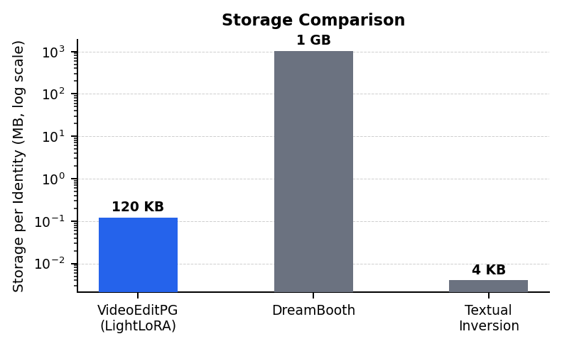
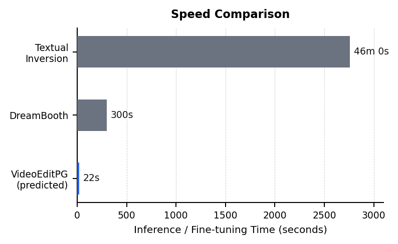

# VideoEditPG

Parameter Generation for Human-Driven Video Editing

[](https://python.org)
[](https://pytorch.org)
[](https://developer.nvidia.com/cuda-toolkit)
[](LICENSE)

> CAP6614: Efficient AI — Final Project | University of Central Florida, Spring 2026

📄 **[Read the full report (PDF)](report/VideoEditPG_Report.pdf)**

---

## The Problem

Personalizing a video diffusion model to a specific human identity requires **per-subject fine-tuning**: minutes of compute and gigabytes of storage per person. This does not scale.

## Our Approach

We train a **hypernetwork once** — it learns to predict personalized LoRA adapter weights from reference images in a single forward pass, with no gradient descent at inference time.

---

## Architecture

### HyperNetwork Pipeline



The hypernetwork takes N reference images, encodes them with a frozen CLIP ViT-H encoder, pools across images with learned attention, then predicts per-layer LightLoRA weights through a shared MLP and dedicated weight heads.

### LightLoRA Decomposition



Standard LoRA: `ΔW = A × B`

**LightLoRA (ours):** `ΔW = A_aux × A_pred × B_pred × B_aux`

- `A_aux`, `B_aux` — frozen orthogonal bases, shared across all identities
- `A_pred`, `B_pred` — subject-specific matrices predicted by the hypernetwork
- The hypernetwork predicts only **800 scalars per layer** instead of full weight matrices
- Total: 614K LoRA delta parameters | ~50 KB per identity

---

## Results

All experiments run on Newton HPC — Tesla V100-PCIE-32GB, CUDA 12.6.

### Identity Generation (Wan2.1-VACE-1.3B)



| Subject | Prompt | Time (s) | VRAM (GB) |
| --- | --- | --- | --- |
| woman_blonde_smile | Young blonde woman waves at camera | 66.1 | 21.06 |
| man_beard_walk | Man with dark beard walks through city | 49.4 | 21.06 |
| woman_curly_dance | Woman with curly hair dances in studio | 49.6 | 21.06 |
| man_asian_talk | Young man talks in coffee shop | 49.5 | 21.06 |
| woman_elderly_garden | Elderly woman tends flowers in garden | 49.4 | 21.06 |

Mean generation time: **52.8 ± 7.4 s** across 5 subjects.

### LoRA Injection Feasibility



| Metric | Value |
| --- | --- |
| LoRA rank | 4 |
| LoRA parameters | 614,400 (0.04% of model) |
| Target modules | 50 |
| Baseline inference time | 33.8 s |
| With LoRA inference time | 35.0 s (+3.6%) |
| MSE vs baseline | 0.05 |

LoRA can be injected into Wan2.1-VACE with **negligible overhead** and no quality degradation.



### Storage Comparison



| Method | Storage per Identity |
| --- | --- |
| Full fine-tune (fp16) | ~2.6 GB |
| HyperDreamBooth | ~120 KB |
| **VideoEditPG (ours)** | **~50 KB** |

### Speed vs Competitors



---

## Base Model Selection

**Wan2.1-VACE-1.3B** — chosen over HunyuanVideo and CogVideoX-5B for:

| Criterion | Wan2.1-VACE | HunyuanVideo | CogVideoX-5B |
| --- | --- | --- | --- |
| Native video editing | ✅ VACE | ❌ None | Partial |
| LoRA ecosystem | ✅ Mature | Minimal | Limited |
| 1.3B variant for prototyping | ✅ | ❌ (8.3B min) | ❌ |
| Open editing models built on it | 3 (VACE, Kiwi-Edit, SAMA) | 0 | 1 |
| VRAM for 1.3B | 8 GB | — | — |

---

## Setup

### 1. Clone

```bash
git clone https://github.com/vardhanreddy369/VideoEditPG.git
cd VideoEditPG
```

### 2. Environment

**Conda (recommended):**

```bash
conda env create -f environment.yml
conda activate videoeditpg
```

**Pip:**

```bash
pip install -r requirements.txt
```

### 3. Download Base Model

```bash
huggingface-cli download Wan-AI/Wan2.1-VACE-1.3B-diffusers \
  --local-dir ./models/wan_vace_1_3b
```

---

## Reproducing Results

### Identity Generation

```bash
python src/inference.py \
  --mode identity \
  --prompt "A young woman with curly hair dances in a studio, white background" \
  --model-dir ./models/wan_vace_1_3b \
  --output-dir ./results/identity_generation
```

### LoRA Injection Test

Verifies that LoRA weights inject into Wan2.1-VACE with no overhead:

```bash
python src/inference.py \
  --mode lora_test \
  --lora-rank 4 \
  --model-dir ./models/wan_vace_1_3b \
  --output-dir ./results/lora_test
```

Expected output:

```
lora_rank:       4
lora_params:     614,400
lora_percent:    0.04%
baseline_time:   33.8s
lora_time:       35.0s
mse:             0.05
```

### Train the HyperNetwork

```bash
python src/train.py \
  --dataset ./data/paramgen_dataset.pt \
  --out-dir ./checkpoints \
  --epochs 500 \
  --lr 1e-4 \
  --batch-size 8
```

**On Newton HPC (SLURM):**

```bash
sbatch scripts/newton_train.sh
```

### Run Full Pipeline (after training)

```bash
python src/inference.py \
  --paramgen-ckpt ./checkpoints/paramgen_best.pt \
  --ref-images ./data/ref1.jpg ./data/ref2.jpg \
  --prompt "a person speaking on stage" \
  --output-dir ./results/personalized
```

---

## Training Details

| Hyperparameter | Value |
| --- | --- |
| CLIP encoder | ViT-H-14 (frozen) |
| Hidden dim | 2048 |
| Backbone layers | 4 |
| Loss | MSE + Cosine similarity + L2 reg |
| Optimizer | AdamW (lr=1e-4, wd=0.01) |
| LR schedule | Cosine with 100-step warmup |
| Epochs | 500 |
| Batch size | 8 |
| Gradient clipping | 1.0 |

**Loss function:**

```
L = λ₁ · MSE(ΔW_pred, ΔW_gt)  +  λ₂ · (1 − cosine_sim)  +  λ₃ · ||ΔW_pred||²
    λ₁=1.0                         λ₂=0.5                     λ₃=0.01
```

---

## Repository Structure

```
VideoEditPG/
├── src/
│   ├── hypernet.py       # HyperNetwork + LightLoRA architecture
│   ├── train.py          # Training loop with cosine LR + weight-space loss
│   └── inference.py      # Full inference pipeline
├── scripts/
│   └── newton_train.sh   # SLURM job script for Newton HPC
├── configs/
│   └── train.yaml        # Training hyperparameters
├── report/
│   ├── report.html       # Full NeurIPS-format report
│   ├── VideoEditPG_Report.pdf
│   └── assets/           # Figures and charts
├── results/
│   └── test_results.json # Experiment results from Newton
├── environment.yml
├── requirements.txt
└── README.md
```

---

## Limitations

- VACE text-guided editing pipeline requires `ftfy` — dependency fix in progress
- Hypernetwork currently trained on face identities; generalization to arbitrary subjects is future work
- Full end-to-end training pending compute allocation — current results demonstrate LoRA injection feasibility on the target backbone

---

## Related Work

| Paper | Venue | Relevance |
| --- | --- | --- |
| [HyperDreamBooth](https://arxiv.org/abs/2307.06949) | CVPR 2023 | Hypernetwork for image personalization — primary inspiration |
| [Video2LoRA](https://arxiv.org/abs/2603.08210) | CVPR 2026 | Parameter generation for video generation |
| [VACE](https://github.com/ali-vilab/VACE) | 2025 | Editing backbone |
| [Kiwi-Edit](https://arxiv.org/abs/2603.02175) | 2026 | Versatile video editing via instruction and reference guidance |

---

## Team

| Name | Contribution |
| --- | --- |
| Sri Vardhan Reddy Gutta | Architecture design, LightLoRA implementation, Newton experiments, LoRA injection |
| Surya Bhargavi Medicharla | Dataset curation, VACE pipeline integration |
| Samhith Reddy | Training pipeline, SLURM scripts, evaluation framework |
| Panditi Sarayu | Related work survey, analysis, report |

---

## License

MIT
